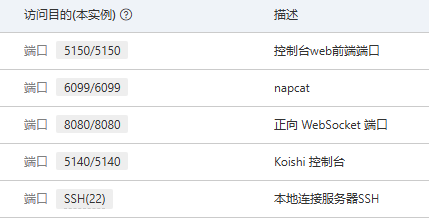
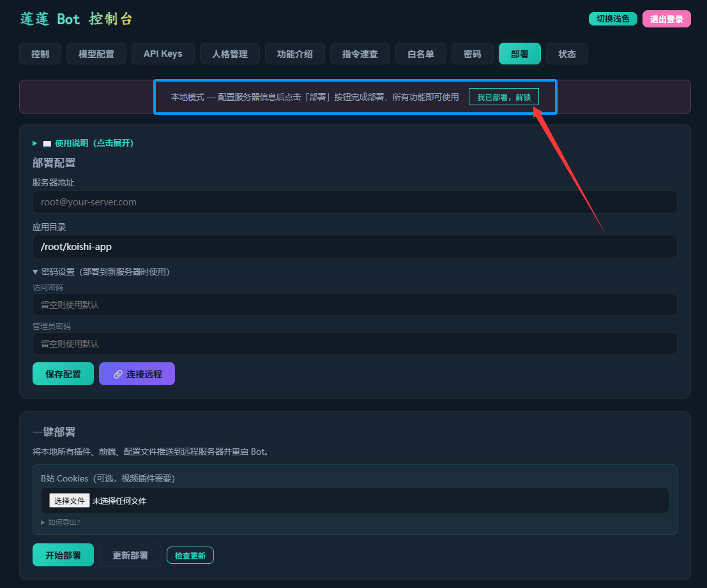
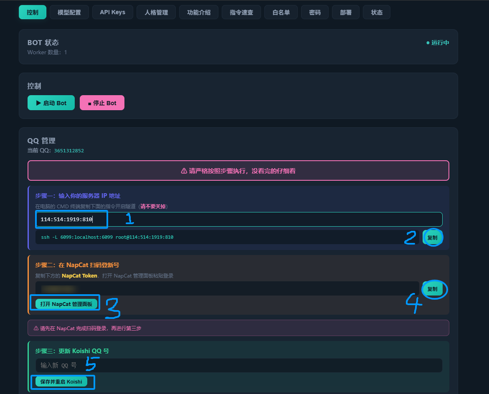
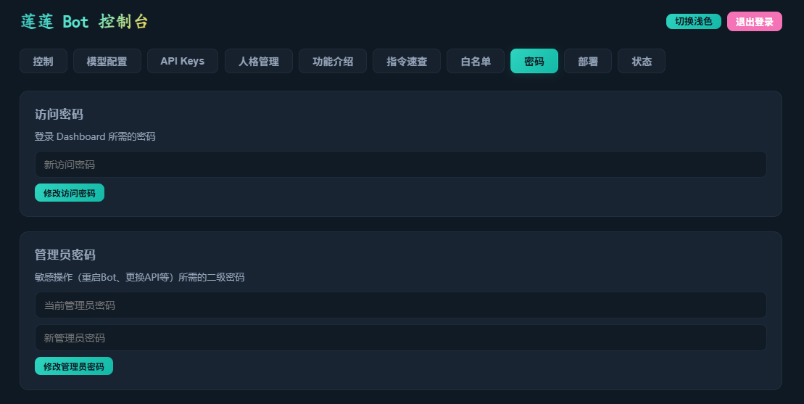
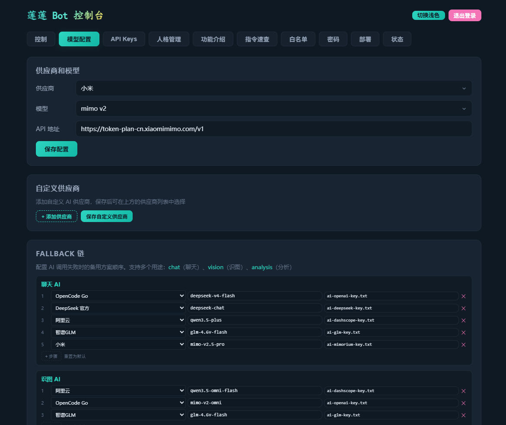
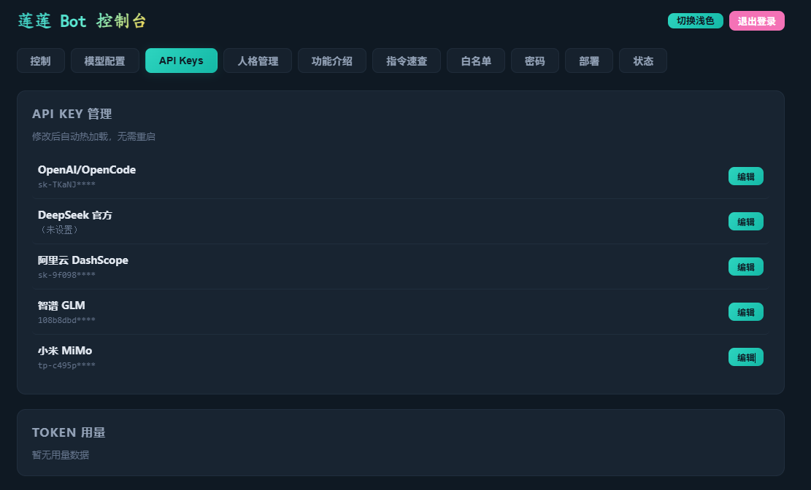

# 东雪莲QQBot-极致嘴臭

本项目是一套基于 `Koishi + NapCat + OneBot` 的 QQ 机器人部署仓库。当前采用 `md + sh + js` 共存结构：文档负责说明和交接，脚本负责部署，插件代码负责实际运行。

项目目标很直接：让普通用户能用网页控制台在 Windows 本机部署机器人，或把机器人部署到 Linux 服务器上，同时让维护者能继续按插件边界迭代功能。

准备材料：

- 一台自己的电脑，最好是win。
- （可选）一台 Linux 服务器，2 核 2G 起步即可。
- 一个机器人 QQ 号，建议不要使用主号，注意账号风控。
- 可选：AI 供应商 API Key、B 站 cookies。

部署方式：

- 可选本地部署或服务器部署
- 使用 Web 前端部署：看「二、Web 前端快速部署」。
- 使用 exe 软件部署：看「三、exe部署」。

---

## 一、当前功能一览

| 模块 | 对应代码 | 主要能力 |
|------|----------|----------|
| Dashboard 控制台 | `packages/koishi-plugin-dashboard/` | 独立 Web 管理面板、Bot 启停、维护模式、QQ 号切换、Windows 本地部署、远程一键部署、密码管理、莲莲图集 |
| AI 对话 | `packages/koishi-plugin-dongxuelian-ai/` | @ 触发、私聊触发、群聊概率主动回复、模型切换、联网搜索、上下文记忆、人格系统 |
| 帮助菜单 | `packages/koishi-plugin-dongxuelian-help/` | `help东雪莲`、`helpAI`、`help集合`、`指令速查` 等菜单 |
| 昵称与集合 | `packages/koishi-plugin-group-name-at/` | 昵称绑定、集合管理、集合运算、`at昵称` / `at集合` 批量艾特 |
| B 站视频发送 | `packages/koishi-plugin-local-video-sender/` | 自动识别 B 站链接、调用 `yt-dlp` 下载 720P 优先视频并发送 |
| 群聊日报 | `packages/koishi-plugin-daily-report/` | `群聊日报`、`群聊详细日报`，生成群聊统计和图片日报 |
| 退群提醒 | `packages/koishi-plugin-group-leave-notice/` | 监听成员退群事件并在群内提醒 |
| 戳一戳回应 | `packages/koishi-plugin-dongxuelian-poke/` | 收到戳一戳后调用 NapCat OneBot 扩展接口回戳 |
| 对话防护 | `packages/koishi-plugin-defense/` | 拦截常见提示词套话、角色覆盖、格式控制等输入 |

其他已经接入的能力：

- 支持 OpenCode Go、DeepSeek 官方、阿里云 DashScope、智谱 GLM、小米 MiMo 等供应商。
- 支持 API Key、模型、Base URL 在 Dashboard 中热更新。
- 支持用户级人格、群级人格、世界观 lore、系统模式 modes。
- 支持用户黑名单、群聊 AI 白名单、静默白名单、视频黑名单、解除上限群白名单。
- 支持敏感话题检测、处理者通知、原始事件抓取、今日情绪分析、谁艾特我、定位消息。
- 支持 Dashboard 独立守护，Koishi 重启不影响控制台。

---

## 二、Web 前端快速部署

### 2.1 先配置服务器安全组

先在云服务器安全组里放行需要用到的端口。

| 端口 | 用途 | 建议 |
|------|------|------|
| `5150` | Dashboard 独立控制台 | 需要从浏览器访问，必须放行 |
| `6099` | NapCat 后台管理页 | 可以公网放行，也可以只通过 SSH 隧道访问 |
| `8080` | NapCat 给 Koishi 连接的 OneBot WebSocket | Koishi 和 NapCat 同机时建议只监听本机；新手可先按图放行排错 |
| `5140` | Koishi server 插件端口 | 通常不需要对公网开放，除非你明确要访问 Koishi 自身服务 |
| `22` | SSH 登录服务器 | 必须能从你的电脑连上，建议限制来源 IP |

配置好后如图：



> 当前主线配置以 `setup.sh` 和 Dashboard 部署逻辑为准：NapCat OneBot WebSocket 默认使用 `8080`。如果你手动改成 `8081`，NapCat 和 `koishi.yml` 必须同时一致。

### 2.2 打开 Dashboard

部署完成后访问：

```text
http://服务器IP:5150/dashboard/
```

首次密码请通过环境变量或数据文件设置；正式使用后也可以在「密码」页修改。

| 类型 | 默认值 | 说明 |
|------|--------|------|
| 访问密码 | 无固定默认 | 登录 Dashboard 用；进入网站的第一个界面只需要这个密码 |
| 管理员密码 | `123` | 修改配置、部署、启停 Bot、修改密码等敏感操作会二次验证 |

另外，SSH 登录服务器使用的是服务器系统账号密码，不属于 Dashboard 密码体系，不会写进前端或仓库。




如果已经部署过，可以点击「我已部署，解锁」进入完整功能页；也可以继续使用「部署」Tab 生成 Windows 本地配置或更新远程服务器代码。
B 站视频搬运功能需要浏览器导出的 `cookies.txt`。部署面板里可以上传，部署时会自动推送到远程服务器。

### 2.3 按控制台里的步骤操作

QQ 管理页会给出 SSH 隧道指令、NapCat Token、QQ 号更新入口。



在「密码」页可以修改访问密码和管理员密码。



在「模型配置」页选择供应商、模型和 API 地址。



在「API Keys」页配置各供应商密钥。




### 2.4 本地启动 Dashboard 部署工具

如果你是在自己的电脑上先启动部署面板，再把 Bot 部署到远程服务器，可以这样做：

```bash
npm install
cd packages/koishi-plugin-dashboard
node standalone.js
```

然后在浏览器打开：

```text
http://localhost:5150/dashboard/
```

如果你改过前端源码，先重新构建前端：

```bash
cd packages/koishi-plugin-dashboard/frontend
npm install
npm run build
```

### 2.5 部署面板会做什么

Dashboard 的「部署」Tab 有两个模式。

Windows 本地部署会在当前项目目录内准备运行环境：

- 未检测到 Node.js/npm 时，可安装便携 Node/npm 到 `runtime/node/`，由本部署器管理并可在一键卸载时删除。部署器下载的是 Node.js 官方 Windows LTS zip，包内自带 `node.exe`、`npm.cmd`、`npx.cmd`，所以安装便携 Node/npm 会同时获得 npm。打包版一键部署会优先使用部署器自己的便携 Node/npm，避免误用系统 PATH 里的环境。
- 便携 Node/npm 与 NapCat 自动安装会先清理旧的 `runtime/*-install-*` 暂存目录和半成品目标目录；遇到文件占用或路径层级冲突时会重试并显示具体冲突路径。
- 源码版按需创建 `runtime/downloads/`、`runtime/logs/`、`runtime/napcat/` 和 `data/`；打包版只有在点击安装、生成配置或一键部署等写入动作时才创建 EXE 同级的 `LianLianBOT/` 工作目录。
- 检测 Node.js、npm、中文路径写入和 `5140`、`5150`、`8080`、`6099` 端口状态。
- 生成 `koishi.yml` 和 `start-local.bat`。
- `npm` 状态卡只表示 npm 命令程序是否可用；`项目依赖` 状态卡表示本项目 `node_modules` 是否已通过 `npm install` 安装完整。若 npm 继承了失效的 `127.0.0.1` 本机代理，部署器会在执行 `npm install` 前自动清理本次安装环境并切换到 npm 镜像源；任务退出后还会复核缺失依赖，避免把 `EXIT 0` 误报成安装失败。
- 写入 AI 供应商、模型、Base URL、API Key 等本地配置。
- 莲莲图集支持普通登录用户上传图片、16:9/4:3/9:16 展示、A-G 闪卡样式选择和按图片持久化；图片读取接口公开给浏览器 `` 使用，上传后会校验真实图片格式并刷新缓存版本。
- OneBot WebSocket 固定使用 `ws://127.0.0.1:8080/onebot/v11/ws`。

远程 Linux 部署会通过 SSH / SCP 把当前 Dashboard 后端所在机器上的本地项目推送到远程服务器，默认目标目录是 `/root/koishi-app`。如果你访问的是云服务器上的 Dashboard，这里的“本地”就是那台云服务器，不是浏览器所在的 Windows 电脑。

部署内容包括：

- 所有插件的 `lib/` 代码和 `package.json`。
- Dashboard 的 `standalone.js` 与前端 `dist/`。
- `ai-skills/` 人格、世界观、模式等数据文件。
- 当前本地已有的 AI 配置文件和黑白名单文件。
- `restart.sh` 与 `watchdog.sh`。
- B 站 cookies 文件（如果你上传了）。
- `yt-dlp` 和 `/root/koishi-bili-downloads` 视频下载目录。

部署前确认：

- 本机能直接 `ssh root@服务器IP` 登录。
- 服务器有 Node.js 18 或更高版本。
- 服务器安全组至少开放 `22` 和 `5150`。
- 机器人 QQ 已能在 NapCat 中扫码登录。
- 「开始远程操作」不会从 GitHub 拉取文件，只会把当前后端机器上的插件代码、Dashboard `dist/` 和脚本推送到目标目录。
- 「重建前端」只会在当前后端机器本地执行前端构建并刷新本机 `dist/`；需要把新页面同步到远端时，构建成功后再执行远程操作。

---

## 三、exe部署

Windows EXE 部署器入口在 `local-deployer/`。

源码目录里可以直接双击根目录的 `启动本地部署器.bat`。它会检查 Node.js、自动安装本地部署器依赖，然后拉起桌面窗口。

开发运行：

```powershell
cd local-deployer
npm install
npm run start
```

打包 portable EXE：

```powershell
cd local-deployer
npm install
npm run build:win
```

也可以在根目录双击 `构建Windows部署器.bat`，它会先构建 Dashboard 前端，再打包 Windows 部署器。Release 附件统一上传 `local-deployer/release/LianLianBOT-Deployer-v版本号.zip`，不再裸传 EXE。用户需要先完整解压 zip，再运行解压目录里的 `莲莲Bot部署器.exe`。

卸载源码版本地部署器可以双击 `卸载本地部署器.bat`。默认只清理依赖和构建产物，不删除 `data/`、`runtime/`、`koishi.yml`、`start-local.bat`；输入 `YES` 才会彻底删除这些运行时文件。

EXE 的职责是启动本地 Dashboard，并复用 Dashboard 的「部署」页完成两类任务。打包版仅启动或检测环境时不会创建工作目录；首次点击安装 Node/NapCat、生成配置或一键部署时，才会在 EXE 所在目录旁创建 `LianLianBOT/`。所有可写入的环境、配置、依赖、下载包、图集和日志都集中放到这里，避免写进 Electron 临时解包目录。

- Windows 本地部署：所有下载、日志、便携 Node/npm、NapCat 文件都放 `LianLianBOT/runtime/` 下，项目依赖放 `LianLianBOT/node_modules/`，Dashboard 与 Bot 配置放 `LianLianBOT/data/`。
- 远程 Linux 部署：填写 SSH 目标和应用目录后推送更新。

源码 Web Dashboard 仍使用访问密码和管理员密码；Electron 本地部署器模式会自动进入，不显示访问密码页、管理员密码弹窗或重置密码框。删除和一键卸载只保留确认弹窗，不需要输入密码。Release 成品以 zip 附件发布；解压后的整个 `LianLianBOT-Deployer/` 文件夹可以整体备份、迁移或删除。

---

## 四、整体架构

机器人消息链路如下：

```text
QQ 账号
  ↓
NapCat 登录 QQ，并暴露 OneBot WebSocket
  ↓ ws://127.0.0.1:8080/onebot/v11/ws
Koishi adapter-onebot 接收消息
  ↓
本仓库 packages/* 插件处理消息
  ↓
需要时调用 AI API / 本地数据 / yt-dlp / Puppeteer 渲染
```

也就是说：

- `NapCat` 负责连接 QQ。
- `Koishi` 负责加载插件和分发消息。
- 本仓库负责提供插件、部署脚本、Dashboard 控制台和数据文件。

如果 NapCat 没有先跑通，Koishi 和插件就无法正常收发群消息。

### 4.1 当前仓库结构

| 路径 | 作用 |
|------|------|
| `README.md` | 项目总入口、部署说明、维护说明 |
| `指令速查.md` | 面向群内使用者的命令速查 |
| `教程.md` | AI + Skill 接入说明 |
| `部署教程.txt` | 更偏传统手工部署的教程备份 |
| `开发总结.md` / `教训总结.md` | 维护记录、踩坑总结、架构决策 |
| `setup.sh` | Linux 一次性安装脚本，偏维护/初始化使用 |
| `scripts/*.sh` | 单插件部署脚本、重启脚本、守护脚本 |
| `packages/koishi-plugin-dashboard/` | Dashboard 独立服务器和 Vue 前端 |
| `packages/koishi-plugin-dongxuelian-ai/` | AI 主插件、人格、记忆、敏感检测、模型调用 |
| `packages/koishi-plugin-daily-report/` | 群聊日报采集、AI 分析、HTML 图片渲染 |
| `packages/*/lib/` | 各 Koishi 插件实际运行代码 |
| `image/` | README 和部署说明用截图 |

### 4.2 插件加载配置示例

服务器上的 `koishi.yml` 最小结构大致如下：

```yaml
plugins:
  server:emicam:
    port: 5140
    selfUrl: http://localhost:5140
  adapter-onebot:xtqqgv:
    protocol: ws
    selfId: '机器人QQ号'
    endpoint: ws://127.0.0.1:8080/onebot/v11/ws
  group-name-at:nyxxfd: {}
  dongxuelian-help:rlmpxx: {}
  dongxuelian-ai:hdi04m: {}
  dongxuelian-poke:nxf8l0: {}
  koishi-plugin-defense:xlyp9f: {}
  local-video-sender:k2w0u7: {}
  group-leave-notice:h6lfrz: {}
  daily-report: {}
```

插件键名后面的随机后缀是 Koishi 常见写法，不要求固定；关键是插件名和对应包已经安装到 `node_modules`。

---

## 五、常用指令速查

更多完整命令见 `指令速查.md`，Dashboard 里也有「指令速查」Tab。

### 5.1 帮助菜单

| 指令 | 说明 |
|------|------|
| `help东雪莲` / `帮助东雪莲` | 查看总帮助 |
| `helpAI` / `AI帮助` | 查看 AI 帮助 |
| `help集合` / `帮助集合` | 查看昵称与集合帮助 |
| `指令速查` / `help速查` | 查看一页版速查 |
| `/help 关键词` | 在帮助文本里模糊搜索 |

### 5.2 AI 常用

| 指令 | 说明 |
|------|------|
| `@东雪莲 你的问题` | 直接触发 AI 回复 |
| `AI状态` | 查看模型、联网、人格、白名单等状态 |
| `AI诊断` | 检查供应商状态，仅 bot 管理员可用 |
| `AI重载` | 重载配置、Skills、人格缓存 |
| `东雪莲联网开` / `东雪莲联网关` / `东雪莲联网查看` | 管理联网搜索 |
| `东雪莲帮我选 A 还是 B` | 随机二选一 |
| `东雪莲吐槽我` | 基于记忆或最近上下文生成简短吐槽 |
| `东雪莲帮我说话 <内容>` | 让 AI 按当前人格替你组织一句话 |
| `今日情绪` | 分析当天群聊情绪，需要群消息缓存 |

### 5.3 模型与供应商

| 指令 | 说明 |
|------|------|
| `可用模型` | 查看所有内置供应商和模型 |
| `供应商 opencode` | 查看 OpenCode Go 可切换模型 |
| `供应商 dashscope` | 查看阿里云 DashScope 可切换模型 |
| `供应商 deepseek` | 查看 DeepSeek 官方可切换模型 |
| `供应商 glm` | 查看智谱 GLM 可切换模型 |
| `供应商 mimorium` | 查看小米 MiMo 可切换模型 |
| `切换模型名` | 例如 `切换deepseek-chat`，会写入当前供应商和模型配置 |

### 5.4 人格与记忆

| 指令 | 说明 |
|------|------|
| `东雪莲我的人格` / `东雪莲人格查看` | 查看当前用户人格 |
| `东雪莲人格列表` | 查看可用人格 |
| `东雪莲人格切换 <名称>` | 切换个人专属人格 |
| `东雪莲人格重置` | 重置个人专属人格 |
| `东雪莲群人格` | 查看群级人格，群管理员/群主可用 |
| `东雪莲群人格切换 <名称>` | 设置群级人格，群管理员/群主可用 |
| `东雪莲群人格重置` | 重置群级人格 |
| `记住xxx` | 写入用户记忆 |
| `东雪莲忘记我` → `确认忘记我` | 清空当前用户记忆 |
| `东雪莲清空群记忆` | 清空本群记忆，群管理员/群主可用 |
| `东雪莲群记忆定时 <小时>` | 设置群记忆定时清空 |

### 5.5 群聊控制和白名单

| 指令 | 说明 |
|------|------|
| `东雪莲群聊AI概率查看` | 查看本群主动回复基础概率 |
| `东雪莲群聊AI概率设置5%` | 设置本群主动回复概率 |
| `东雪莲群聊AI概率重置` | 恢复默认主动回复概率 |
| `群聊AI白名单添加 <群号>` / `删除 <群号>` / `查看` | 管理允许主动回复的群 |
| `群聊AI静默白名单添加 <群号>` / `删除 <群号>` / `查看` | 管理只记录不回复的群 |
| `解除上限群白名单添加 <群号>` / `删除 <群号>` / `查看` | 管理日报、谁艾特我、消息缓存等高级功能白名单 |
| `用户黑名单添加 <QQ号>` / `删除 <QQ号>` / `查看` | 管理不被 AI 处理的用户 |
| `视频黑名单添加群 <群号>` / `删除群 <群号>` / `查看` | 管理不自动解析视频的群 |

### 5.6 昵称、集合和批量艾特

| 指令 | 说明 |
|------|------|
| `@A 昵称 名称A` | 给用户 A 绑定昵称 |
| `删除昵称 名称A` / `删除昵称 名称A @A` | 删除昵称绑定 |
| `查看昵称 名称A` / `谁是 名称A` | 查看昵称对应成员 |
| `查看成员 @A` | 查看某人的昵称和集合 |
| `查看全部昵称` / `nicklist` | 查看本群全部单人昵称 |
| `创建集合 集合A @A @B` | 创建多人集合 |
| `集合添加 集合A @A` / `集合删除 集合A @A` | 增删集合成员 |
| `查看集合 集合A` / `查看全部集合` / `集合列表` | 查看集合 |
| `清空集合 集合A` → `确认清空集合 集合A` | 二次确认清空集合 |
| `删除集合 集合A` → `确认删除集合 集合A` | 二次确认删除集合 |
| `重命名集合 A B` / `复制集合 A B` / `合并集合 A B` | 集合维护 |
| `集合交集 A B` / `集合并集 A B` / `集合差集 A B` | 集合运算 |
| `at名称A` / `at集合A` | 批量艾特昵称或集合成员 |

### 5.7 日报、视频和事件工具

| 指令 | 说明 |
|------|------|
| `群聊日报` | 生成基础统计日报，需要解除上限群白名单 |
| `群聊详细日报` | 调用 AI 生成详细分析日报 |
| `谁艾特我` / `谁@我` | 查看今天谁在群里 @ 了你 |
| `定位消息 <编号>` | 查看 `谁艾特我` 结果的上下文 |
| `bvidl <B站链接或BV号>` | 手动下载并发送 B 站视频 |
| 直接发送 B 站链接 | 自动解析并发送视频，受视频黑名单控制 |
| `sendtestvideo` | 发送本地测试视频 |
| `AI抓事件` / `AI抓事件查看` / `AI抓事件取消` | 抓取下一条原始事件，维护调试用 |

### 5.8 敏感检测和调试开关

| 指令 | 说明 |
|------|------|
| `敏感话题检测开` / `敏感话题检测关` / `敏感话题检测查看` | 管理本群敏感话题检测 |
| `敏感话题处理者添加 <QQ号>` / `删除 <QQ号>` / `查看` | 管理检测通知人 |
| `东雪莲复读开` / `东雪莲复读关` / `东雪莲复读状态` | 管理连续复读功能 |
| `东雪莲测试开` / `东雪莲测试关` | 管理员测试模式 |
| `东雪莲嘴臭开` / `东雪莲嘴臭关` | 管理高强度反击人格开关 |
| `东雪莲思考开` / `东雪莲思考关` | 管理思考调试开关 |

---

## 六、配置文件和数据目录

核心数据目录由 `DONGXUELIAN_AI_DATA_DIR` 控制。服务器部署时默认是：

```text
/root/koishi-app/data
```

本地开发时默认是：

```text
packages/koishi-plugin-dongxuelian-ai/data
```

常见文件：

| 文件 | 说明 |
|------|------|
| `ai-provider.txt` | 当前 AI 供应商 |
| `ai-model.txt` | 当前模型 |
| `ai-base-url.txt` | 当前 OpenAI 兼容 API 地址 |
| `ai-openai-key.txt` | OpenCode / OpenAI 兼容 Key |
| `ai-deepseek-key.txt` | DeepSeek 官方 Key |
| `ai-dashscope-key.txt` | 阿里云 DashScope Key |
| `ai-glm-key.txt` | 智谱 GLM Key |
| `ai-mimorium-key.txt` | 小米 MiMo Key |
| `ai-skills/` | core、modes、personas、lore 等 Skill 文件 |
| `ai-persona-users.json` | 用户级人格绑定 |
| `ai-persona-groups.json` | 群级人格绑定 |
| `ai-random-whitelist.json` | 群聊 AI 主动回复白名单 |
| `ai-silence-whitelist.json` | 群聊 AI 静默白名单 |
| `summary-whitelist.json` | 日报、谁艾特我、消息缓存等高级功能白名单 |
| `ai-user-blacklist.json` | 用户黑名单 |
| `video-blacklist.json` | 视频解析黑名单 |
| `dashboard-access-pwd.txt` | Dashboard 访问密码 |
| `dashboard-admin-pwd.txt` | Dashboard 管理员密码（敏感操作二次验证，文件名保留兼容旧版本） |
| `today-cache-*.json` | 群聊当日缓存 |
| `conversations/` | 对话上下文和摘要 |
| `user-profiles/` | 用户记忆和画像 |

常见环境变量：

| 环境变量 | 默认值 | 说明 |
|----------|--------|------|
| `DASHBOARD_PORT` | `5150` | Dashboard 监听端口 |
| `DASHBOARD_PASSWORD` | 空 | 首次访问密码默认值；为空且没有 `dashboard-access-pwd.txt` 时禁止登录 |
| `DASHBOARD_ADMIN_PASSWORD` | `123` | 首次管理员密码默认值（变量名保留兼容旧版本） |
| `DONGXUELIAN_AI_DATA_DIR` | 插件内 `data` | AI 和 Dashboard 共享数据目录 |
| `KOISHI_APP_DIR` | `/root/koishi-app` | 重启脚本和守护脚本使用的 Koishi 目录 |
| `KOISHI_PORT` | `5140` | Koishi server 端口 |
| `NAPCAT_HOST` | `127.0.0.1` | Dashboard 代理 NapCat 的地址 |
| `NAPCAT_PORT` | `6099` | Dashboard 代理 NapCat 的端口 |
| `BILI_YTDLP` | `/usr/local/bin/yt-dlp` | 视频插件使用的 yt-dlp 路径 |
| `BILI_COOKIES_FILE` | `/root/bilibili-cookies.txt` | B 站 cookies 文件路径 |
| `BILI_WORKDIR` | `/root/koishi-bili-downloads` | 视频临时下载目录 |
| `BILI_MAX_SIZE_BYTES` | `209715200` | 单个视频最大大小，默认 200MB |

---

## 七、启动、重启和守护

### 7.1 服务器上重启 Bot

一键部署会把重启脚本放到目标目录：

```bash
bash /root/koishi-app/restart.sh
```

这个脚本会：

1. 停掉旧 Koishi 进程。
2. 检查 `5140` 是否释放。
3. 确保 Dashboard `5150` 正在运行。
4. 启动 Koishi。
5. 通过日志和端口确认启动结果。

### 7.2 Dashboard 守护脚本

`scripts/watchdog.sh` 会每 10 秒检查 `5150`，Dashboard 崩溃后自动拉起：

```bash
nohup bash /root/koishi-app/scripts/watchdog.sh > /root/koishi-app/packages/koishi-plugin-dashboard/watchdog.log 2>&1 &
```

### 7.3 查看日志

```bash
tail -f /root/koishi-app/koishi.log
```

常见成功日志关键词：

```text
dashboard running on http://localhost:5150/dashboard/
dongxuelian-ai 0.11.0 loaded
group-name-at 0.4.7 loaded
daily-report loaded
adapter connect to server
```

---

## 八、本地开发和测试

安装依赖：

```bash
npm install
```

语法检查：

```bash
npm run check
```

快速测试：

```bash
npm run test:quick
```

场景测试：

```bash
npm run test:scenario
```

插件测试：

```bash
npm run test:plugins
```

完整测试：

```bash
npm test
```

Dashboard 前端开发：

```bash
cd packages/koishi-plugin-dashboard/frontend
npm install
npm run dev
```

Dashboard 前端构建：

```bash
cd packages/koishi-plugin-dashboard/frontend
npm run build
```

更多测试细节见 `TESTING.md`。

---

## 九、单插件脚本部署

如果不用 Dashboard 一键部署，也可以在服务器上手动执行 `scripts/*.sh`。这些脚本会把 `packages/*` 里的代码复制到 `/root/koishi-app/node_modules/`，并把插件写入 `koishi.yml`。

默认 Koishi 目录是 `/root/koishi-app`。如果你的目录不同，可以设置：

```bash
KOISHI_APP_DIR=/你的/koishi目录 sh scripts/help.sh
```

常见脚本：

| 脚本 | 部署内容 | 验证方式 |
|------|----------|----------|
| `scripts/help.sh` | 帮助菜单 | 群里发 `help东雪莲` |
| `scripts/name.sh` | 昵称和集合 | 群里发 `查看全部昵称` |
| `scripts/ai.sh` | AI 主插件和 Skills | 群里发 `AI状态` 或 @ 机器人 |
| `scripts/vedio.sh` | B 站视频插件 | 群里发 B 站链接 |
| `scripts/defense.sh` | 对话防护插件 | @ 机器人并发送常见套话测试 |
| `scripts/poke.sh` | 戳一戳回应 | 戳一戳机器人 |
| `scripts/leave.sh` | 退群提醒 | 小号退群测试 |
| `scripts/restart-bot.sh` | 服务器重启脚本 | `bash /root/koishi-app/restart.sh` |
| `scripts/watchdog.sh` | Dashboard 守护脚本 | 检查 `5150` 端口 |

---

## 十、常见问题

### 10.1 Dashboard 打不开

先查端口和进程：

```bash
ss -tlnp | grep 5150
tail -f /root/koishi-app/koishi.log
```

检查项：

- 服务器安全组是否放行 `5150`。
- `DASHBOARD_PORT` 是否被改过。
- `packages/koishi-plugin-dashboard/frontend/dist/` 是否存在。
- `watchdog.sh` 是否正在守护 Dashboard。

### 10.2 Koishi 连不上 NapCat

检查 NapCat WebSocket 是否监听：

```bash
ss -ltnp | grep 8080
```

检查项：

- NapCat 是否登录了机器人 QQ。
- NapCat 是否启用了正向 WebSocket。
- `koishi.yml` 里的 `endpoint` 是否和 NapCat 端口一致。
- `selfId` 是否是机器人 QQ 号。
- 如果设置了 Access Token，NapCat 和 Koishi 必须一致。

### 10.3 AI 不回复

优先看：

- `AI状态` 是否能正常返回。
- 供应商、模型、Base URL 是否匹配。
- 对应 API Key 文件是否存在。
- 群是否在 `群聊AI白名单` 中。
- 群是否在 `群聊AI静默白名单` 中。
- 用户是否在 `用户黑名单` 中。
- 是否开启了维护模式。

### 10.4 日报没有数据

日报依赖消息缓存。检查：

- 群号是否在 `解除上限群白名单` 中。
- 今天是否已经有足够群消息。
- 服务器是否能找到 Chrome / Chromium；否则图片渲染会失败。
- `群聊详细日报` 会调用 AI，API 配置失败时会降级或报错。

### 10.5 B 站视频发不出来

检查：

- `yt-dlp` 是否安装：`yt-dlp --version`。
- `BILI_COOKIES_FILE` 指向的 cookies 文件是否存在。
- 视频是否超过 `BILI_MAX_SIZE_BYTES`。
- 群是否在视频黑名单中。
- 服务器是否安装了合并视频所需的基础环境。

### 10.6 5141 或 80 是不是本项目端口

当前项目主线代码没有使用 `5141` 或 `80` 作为业务监听端口。如果云防火墙里有这两个端口，多半是旧规则、其他服务或反向代理规则。

---

## 十一、维护说明

这个仓库当前优先服务“能部署、能跑、能维护”。维护时建议遵守：

- 部署脚本只做部署，不内嵌插件业务源码。
- 插件逻辑放在 `packages/*/lib/`，不要继续把大段 JS 塞回 Markdown。
- 修改 AI 主插件前先看 `AI协作规则.md`、`教训总结.md`、`TESTING.md`。
- 通用变更写进 `progress.md`，专题经验写进对应文档。
- 改 Dashboard 前端后记得在 `packages/koishi-plugin-dashboard/frontend/` 里重新 `npm run build`。
- 改插件后至少跑 `npm run check`，风险高的改动继续跑 `npm test`。
- 修改端口、数据目录、部署路径时，同时检查 README、`setup.sh`、`scripts/restart-bot.sh`、`packages/koishi-plugin-dashboard/standalone.js`。

当前推荐继续沿着三层结构维护：

- `README.md` / `指令速查.md` / `教程.md` / `progress.md` / `教训总结.md`：中文文档层。
- `scripts/*.sh`：部署执行层。
- `packages/*`：插件代码层。
